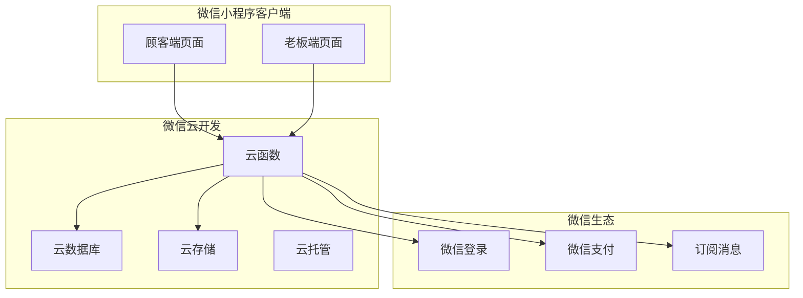

# 中医按摩推拿店预约小程序

Feature Name: tcm-massage-appointment
Updated: 2026-06-09

## 描述

基于微信小程序原生开发 + 微信云开发的中医按摩推拿预约系统，支持顾客端预约和老板端管理功能。

## 架构



**架构说明：**

1. **客户端层**：微信小程序原生页面，分为顾客端和老板端两大模块
2. **云开发层**：使用微信云开发的 Serverless 能力
   - 云函数：业务逻辑处理
   - 云数据库：数据存储（JSON 文档型）
   - 云存储：图片等资源存储
3. **微信服务**：集成微信登录、支付、消息推送能力

## 组件和接口

### 小程序目录结构

```
/miniprogram/
├── pages/
│   ├── customer/          # 顾客端页面
│   │   ├── index/         # 首页
│   │   ├── services/      # 服务列表
│   │   ├── service-detail/# 服务详情（含预约）
│   │   ├── orders/        # 我的订单
│   │   └── profile/       # 个人中心（含会员）
│   └── boss/              # 老板端页面
│       ├── dashboard/     # 数据看板
│       ├── services-mgr/  # 服务管理
│       ├── orders-mgr/    # 订单管理
│       └── stats/         # 统计分析
├── components/            # 公共组件
│   ├── service-card/      # 服务项目卡片
│   ├── time-picker/       # 时间选择器
│   └── rating/            # 评价组件
├── cloud/                 # 云函数
│   ├── login/             # 登录
│   ├── services/          # 服务管理
│   ├── appointments/      # 预约管理
│   ├── orders/            # 订单管理
│   ├── members/           # 会员管理
│   └── statistics/        # 数据统计
└── utils/                 # 工具函数
```

### 云函数接口

| 云函数 | 输入参数 | 返回结果 | 说明 |
|--------|---------|---------|------|
| login | code | userInfo, token | 微信登录 |
| getServices | { category? } | services[] | 获取服务列表 |
| manageService | { action, data } | result | 服务增删改 |
| getSchedule | { date } | schedule[] | 获取排班 |
| createAppointment | { serviceId, time } | orderId | 创建预约 |
| cancelAppointment | { orderId } | result | 取消预约 |
| getOrders | { userId?, status? } | orders[] | 获取订单列表 |
| updateOrderStatus | { orderId, status } | result | 更新订单状态 |
| submitReview | { orderId, rating, content } | result | 提交评价 |
| getMemberInfo | { userId } | memberInfo | 获取会员信息 |
| getStatistics | { dateRange, type } | stats | 获取统计数据 |

## 数据模型

### 用户集合 (users)

```javascript
{
  _id: "openid_xxx",
  openid: "微信 openid",
  nickname: "用户昵称",
  avatar: "头像 URL",
  phone: "手机号",
  role: "customer | boss",  // 顾客/老板
  createdAt: Date,
  updatedAt: Date
}
```

### 服务项目集合 (services)

```javascript
{
  _id: "自动生成的 ID",
  name: "项目名称",
  description: "项目描述",
  price: 198,              // 价格（分）
  duration: 60,            // 时长（分钟）
  image: "云存储 URL",
  category: "推拿 | 艾灸 | 拔罐",
  status: "active | inactive",
  createdAt: Date,
  updatedAt: Date
}
```

### 排班集合 (schedules)

```javascript
{
  _id: "自动生成的 ID",
  date: "2026-06-09",          // 日期
  timeSlot: "10:00-11:00",     // 时间段
  maxBookings: 1,              // 最大预约数
  currentBookings: 0,          // 已预约数
  status: "available | full | unavailable",
  createdAt: Date
}
```

**说明**：排班由老板端通过后台批量生成，系统默认每天生成 9:00-21:00 的整点时段。

### 订单集合 (orders)

```javascript
{
  _id: "自动生成的 ID",
  orderNo: "202606090001",     // 订单号
  userId: "用户 openid",
  serviceId: "服务 ID",
  appointmentTime: Date,       // 预约时间
  status: "pending | confirmed | completed | cancelled",
  remark: "用户备注",
  amount: 19800,               // 金额（分）
  memberDiscount: 0,           // 会员折扣
  finalAmount: 19800,          // 实付金额
  review: {                    // 评价（完成后填写）
    rating: 5,
    content: "很满意",
    createdAt: Date
  },
  createdAt: Date,
  updatedAt: Date
}
```

### 会员集合 (members)

```javascript
{
  _id: "用户 openid",
  userId: "用户 openid",
  level: "normal | silver | gold | platinum",
  points: 1200,                // 积分
  totalConsumption: 500000,    // 累计消费（分）
  levelHistory: [{
    level: "silver",
    achievedAt: Date
  }],
  pointsHistory: [{
    type: "earn | spend",
    points: 100,
    orderId: "订单 ID",
    createdAt: Date
  }],
  createdAt: Date,
  updatedAt: Date
}
```

### 评价集合 (reviews)

```javascript
{
  _id: "自动生成的 ID",
  orderId: "订单 ID",
  userId: "用户 openid",
  rating: 5,
  content: "评价内容",
  createdAt: Date
}
```

## 正确性约束

1. **订单号唯一性**：订单号按日期生成，格式为 YYYYMMDD + 4 位序号，保证唯一
2. **预约冲突检测**：同一时间段的最大预约数不得超过限制
3. **取消时间限制**：距离预约时间小于 2 小时的订单不可取消
4. **积分计算**：每消费 1 元积 1 分，积分只能增加或消费，不能为负
5. **会员等级**：根据累计消费金额自动升级，降级需人工操作
6. **评价唯一性**：每个已完成订单只能评价一次

## 错误处理

| 错误场景 | 处理策略 |
|---------|---------|
| 微信登录失败 | 显示错误提示，提供重试按钮 |
| 云函数调用失败 | 统一拦截，显示网络错误，记录日志 |
| 数据库操作失败 | 事务回滚，提示用户重试 |
| 预约时间冲突 | 实时检测并提示时段已满，推荐其他时间 |
| 取消订单超时 | 提示超出取消时限，请联系店家 |
| 图片上传失败 | 压缩重试，提示存储失败 |

## 测试策略

### 单元测试

- 云函数逻辑测试（使用云开发本地模拟）
- 工具函数测试（积分计算、时间格式化等）
- 数据验证逻辑测试

### 集成测试

- 登录流程测试
- 预约完整流程测试
- 订单状态流转测试
- 会员积分累计测试

### 真机测试

- 各机型兼容性测试
- 微信版本兼容性测试
- 网络异常场景测试
- 性能测试（页面渲染、数据加载）

## 参考资料

[^1]: (微信云开发文档) - https://developers.weixin.qq.com/miniprogram/dev/wxcloud/basis/getting-started.html
[^2]: (微信小程序开发文档) - https://developers.weixin.qq.com/miniprogram/dev/framework/
[^3]: (微信登录接口) - https://developers.weixin.qq.com/miniprogram/dev/api/open-api/login/code2Session.html
